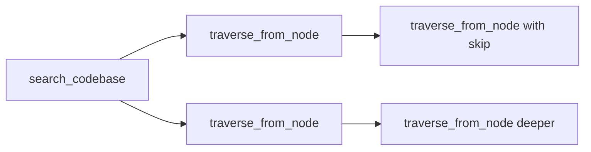

# Code Graph Context MCP Server

[](LICENSE)
[](https://typescriptlang.org/)
[](https://neo4j.com/)

A Model Context Protocol (MCP) server that builds rich code graphs to provide deep contextual understanding of TypeScript/NestJS codebases to Large Language Models. This server parses your codebase, constructs a comprehensive graph representation in Neo4j, and provides intelligent querying capabilities through semantic search and natural language to Cypher conversion.

## 🌟 Features

- **📊 Rich Code Graph Generation**: Parses TypeScript/NestJS projects and creates detailed graph representations with AST-level precision
- **🔍 Semantic Search**: Vector-based semantic search using OpenAI embeddings to find relevant code patterns and implementations
- **🗣️ Natural Language Querying**: Convert natural language questions into Cypher queries using OpenAI assitants api
- **🎯 Framework-Aware**: Deep understanding of NestJS patterns (Controllers, Services, Modules, DTOs, Entities, etc.)
- **🕸️ Graph Traversal**: Explore code relationships and dependencies through intelligent graph traversal
- **⚡ High Performance**: Optimized Neo4j storage with vector indexing for fast retrieval
- **🔧 MCP Integration**: Seamless integration with Claude Code and other MCP-compatible tools

## 🏗️ Architecture

The MCP server consists of several key components:

### Core Components

1. **TypeScript Parser** (`src/core/parsers/typescript-parser-v2.ts`): Uses `ts-morph` to parse TypeScript AST and extract code entities
2. **Graph Storage** (`src/storage/neo4j/neo4j.service.ts`): Neo4j integration for storing and querying the code graph
3. **Embeddings Service** (`src/core/embeddings/embeddings.service.ts`): OpenAI integration for semantic search capabilities
4. **MCP Server** (`src/mcp/mcp.server.ts`): Main MCP server providing tools for code analysis

### Graph Schema

The system uses a dual-schema approach:

- **Core Schema**: AST-level nodes (Classes, Methods, Properties, Imports, etc.)
- **Framework Schema**: Semantic interpretations (NestJS Controllers, Services, HTTP Endpoints, etc.)

## 🚀 Getting Started

### Prerequisites

- **Node.js** >= 18
- **Neo4j** >= 5.0 with APOC plugin
- **OpenAI API Key** (for embeddings and natural language processing)
- **Docker** (recommended for Neo4j setup)

### Installation

1. **Clone the repository:**
```bash
git clone https://github.com/drewdrewH/code-graph-context.git
cd code-graph-context
```

2. **Install dependencies:**
```bash
npm install
```

3. **Set up Neo4j using Docker:**
```bash
docker-compose up -d
```

This will start Neo4j with:
- Web interface: http://localhost:7474
- Bolt connection: bolt://localhost:7687
- Username: `neo4j`, Password: `PASSWORD`

4. **Configure environment variables:**
```bash
# Create .env file
cp .env.example .env

# Edit .env with your configuration:
OPENAI_API_KEY=your_openai_api_key_here
NEO4J_URI=bolt://localhost:7687
NEO4J_USER=neo4j
NEO4J_PASSWORD=PASSWORD
```

5. **Build the project:**
```bash
npm run build
```

### Adding to Claude Code

**Method 1: Direct (Recommended)**
```bash
claude mcp add code-graph-context node /absolute/path/to/code-graph-context/dist/mcp/mcp.server.js
```

**Method 2: With Debug Shell** (useful for troubleshooting)
```bash
claude mcp add code-graph-context /absolute/path/to/code-graph-context/debug-mcp.sh
```

**Method 3: Manual Configuration**

Add to your Claude Code MCP configuration file:

```json
{
  "mcpServers": {
    "code-graph-context": {
      "command": "node",
      "args": ["/path/to/code-graph-context/dist/mcp/mcp.server.js"],
      "env": {
        "OPENAI_API_KEY": "your_openai_api_key_here",
        "NEO4J_URI": "bolt://localhost:7687",
        "NEO4J_USER": "neo4j",
        "NEO4J_PASSWORD": "PASSWORD"
      }
    }
  }
}
```

## 📖 Tool Usage Guide & Sequential Workflows

### 🔄 Sequential Tool Usage Patterns

The MCP tools are designed to work together in powerful workflows. Here are the most effective patterns:

#### Pattern 1: Discovery → Focus → Deep Dive


#### Pattern 2: Broad Search → Targeted Analysis
1. **Start Broad**: Use `search_codebase` to find relevant starting points
2. **Focus**: Use `traverse_from_node` to explore specific relationships
3. **Paginate**: Use `skip` parameter to explore different sections of the graph

### 🔧 Tool Deep Dive

#### 1. `search_codebase` - Your Starting Point
**Purpose**: Semantic search using vector embeddings to find the most relevant code nodes.

**Response Structure**: Returns normalized JSON using JSON:API pattern to eliminate duplication:
- **nodes**: Map of unique nodes (stored once, referenced by ID)
- **depths**: Array of depth levels with relationship chains
- **Source Code**: Included by default (truncated to 1000 chars: first 500 + last 500)
- **Statistics**: Total connections, unique files, max depth

**Real Response Example**:
```json
// Query: "JWT token validation"
// Returns:
{
  "totalConnections": 22,
  "uniqueFiles": 2,
  "maxDepth": 3,
  "startNodeId": "MethodDeclaration:697d2c96-1f91-4894-985d-1eece117b72b",
  "nodes": {
    "MethodDeclaration:697d2c96-1f91-4894-985d-1eece117b72b": {
      "id": "MethodDeclaration:697d2c96-1f91-4894-985d-1eece117b72b",
      "type": "MethodDeclaration",
      "filePath": "/packages/jwt-validation/src/lib/jwt.strategy.ts",
      "name": "validate",
      "sourceCode": "validate(payload: EmJwtPayload): EmJwtPayload {\n  ...\n\n... [truncated] ...\n\n  return payload;\n}",
      "hasMore": true,
      "truncated": 1250
    },
    "ClassDeclaration:abc-123": {
      "id": "ClassDeclaration:abc-123",
      "type": "Service",
      "filePath": "/packages/jwt-validation/src/lib/jwt.strategy.ts",
      "name": "JwtStrategy"
    }
  },
  "depths": [
    {
      "depth": 1,
      "count": 8,
      "chains": [
        {
          "via": "HAS_MEMBER",
          "direction": "INCOMING",
          "count": 1,
          "nodeIds": ["ClassDeclaration:abc-123"]
        },
        {
          "via": "HAS_PARAMETER",
          "direction": "OUTGOING",
          "count": 2,
          "nodeIds": ["Parameter:xyz-456", "Parameter:def-789"]
        }
      ]
    },
    {
      "depth": 2,
      "count": 14,
      "chains": [
        {
          "via": "HAS_MEMBER → INJECTS",
          "direction": "INCOMING",
          "count": 3,
          "nodeIds": ["Service:auth-service", "Service:user-service", "Repository:user-repo"],
          "hasMore": 2
        }
      ]
    }
  ]
}
```

**Key Features**:
- **JSON:API Normalization**: Nodes stored once in `nodes` map, referenced by ID to eliminate duplication
- **Source Code Truncation**: Max 1000 chars per snippet (first 500 + last 500 chars)
- **Relationship Chains**: Shows full path like "HAS_MEMBER → INJECTS → USES_REPOSITORY"
- **Direction Indicators**: OUTGOING (what this calls), INCOMING (who calls this)

**Pro Tips**:
- Use specific domain terms: "JWT token validation" vs "authentication"
- Start with limit=1-3 for initial exploration to avoid token limits
- Look for node IDs in `nodes` map to use with `traverse_from_node`
- Check `truncated` field to see how many bytes were hidden from source code

#### 2. `traverse_from_node` - Deep Relationship Exploration
**Purpose**: Explore all connections from a specific node with precise control over depth and pagination.

**Response Structure**: Identical JSON:API format to search_codebase:
- **Focused Traversal**: Starts from your specified node
- **Depth Control**: Configurable max depth (1-10, default 3)
- **Pagination**: Skip parameter for exploring large graphs in chunks
- **Source Code Included by Default**: Set `includeCode: false` for structure-only view

**Real Response Example**:
```json
// Starting from a Service class
// maxDepth: 2, skip: 0, includeCode: true
{
  "totalConnections": 15,
  "uniqueFiles": 4,
  "maxDepth": 2,
  "startNodeId": "ClassDeclaration:credit-check-service",
  "nodes": {
    "ClassDeclaration:credit-check-service": {
      "id": "ClassDeclaration:credit-check-service",
      "type": "Service",
      "filePath": "/src/modules/credit/credit-check.service.ts",
      "name": "CreditCheckService",
      "sourceCode": "@Injectable([CreditCheckRepository, OscilarClient])\nexport class CreditCheckService {\n  ...\n\n... [truncated] ...\n\n}",
      "truncated": 3200
    },
    "Repository:credit-check-repo": {
      "id": "Repository:credit-check-repo",
      "type": "Repository",
      "filePath": "/src/modules/credit/credit-check.repository.ts",
      "name": "CreditCheckRepository"
    }
  },
  "depths": [
    {
      "depth": 1,
      "count": 5,
      "chains": [
        {
          "via": "INJECTS",
          "direction": "OUTGOING",
          "count": 2,
          "nodeIds": ["Repository:credit-check-repo", "VendorClient:oscilar"]
        },
        {
          "via": "HAS_MEMBER",
          "direction": "OUTGOING",
          "count": 3,
          "nodeIds": ["Method:processCheck", "Method:getResult", "Method:rerun"]
        }
      ]
    },
    {
      "depth": 2,
      "count": 10,
      "chains": [
        {
          "via": "INJECTS → USES_DAL",
          "direction": "OUTGOING",
          "count": 1,
          "nodeIds": ["DAL:application-dal"]
        }
      ]
    }
  ]
}
```

**Parameters**:
- `nodeId` (required): Node ID from search_codebase results
- `maxDepth` (default: 3): Traversal depth (1-10)
- `skip` (default: 0): Pagination offset
- `includeCode` (default: **true**): Include source code snippets
- `summaryOnly` (default: false): Just file paths and statistics
- `direction` (default: BOTH): Filter by OUTGOING/INCOMING/BOTH
- `relationshipTypes` (optional): Filter by specific relationships like ["INJECTS", "USES_REPOSITORY"]

**Pagination Strategy**:
```typescript
// Note: Pagination removed in recent commits - all results returned
// Use depth and relationship filtering instead
traverse_from_node({
  nodeId,
  maxDepth: 2,
  relationshipTypes: ["INJECTS"]  // Focus on dependency injection only
})
```

#### 3. `parse_typescript_project` - Graph Generation
**Purpose**: Parse a TypeScript/NestJS project and build the initial graph database.

```typescript
// Full project parsing
await mcp.call('parse_typescript_project', {
  projectPath: '/path/to/your/nestjs/project',
  tsconfigPath: '/path/to/your/nestjs/project/tsconfig.json',
  clearExisting: true // Recommended: clear previous data
});

// Response: Success confirmation with node/edge counts
"✅ SUCCESS: Parsed 2,445 nodes and 4,892 edges. Graph imported to Neo4j."
```

**Performance Notes**:
- Large projects (>1000 files) may take several minutes
- Embedding generation adds significant time but enables semantic search
- Use `clearExisting: true` to avoid duplicate data

#### 4. `test_neo4j_connection` - Health Check
**Purpose**: Verify database connectivity and APOC plugin availability.

```typescript
// Simple health check
await mcp.call('test_neo4j_connection');

// Response indicates database status
"Neo4j connected: Connected! at 2025-07-25T19:48:42.676Z
APOC plugin available with 438 functions"
```

### 🚀 Workflow Examples

#### Example 1: Understanding Authentication Flow
```typescript
// Step 1: Find authentication-related code
const searchResult = await mcp.call('search_codebase', {
  query: 'JWT token validation authentication',
  limit: 2
});

// Step 2: Extract node ID from most relevant result
const nodeId = "MethodDeclaration:697d2c96-1f91-4894-985d-1eece117b72b";

// Step 3: Explore immediate relationships
const immediateConnections = await mcp.call('traverse_from_node', {
  nodeId,
  maxDepth: 2,
  skip: 0
});

// Step 4: Go deeper to understand full authentication chain
const deepConnections = await mcp.call('traverse_from_node', {
  nodeId,
  maxDepth: 4,
  skip: 0
});

// Step 5: Explore different connection branches
const alternateConnections = await mcp.call('traverse_from_node', {
  nodeId,
  maxDepth: 3,
  skip: 10  // Skip first 10 to see different connections
});
```

#### Example 2: API Endpoint Analysis
```typescript
// Step 1: Search for controller endpoints
const controllerSearch = await mcp.call('search_codebase', {
  query: 'HTTP controller endpoints routes POST GET',
  limit: 1
});

// Step 2: Find a controller node ID from results
const controllerNodeId = "ClassDeclaration:controller-uuid";

// Step 3: Explore what endpoints this controller exposes
const endpoints = await mcp.call('traverse_from_node', {
  nodeId: controllerNodeId,
  maxDepth: 2,
  skip: 0
});

// Step 4: For each endpoint found, explore its dependencies
const endpointNodeId = "MethodDeclaration:endpoint-uuid";
const endpointDeps = await mcp.call('traverse_from_node', {
  nodeId: endpointNodeId,
  maxDepth: 3,
  skip: 0
});
```

#### Example 3: Service Dependency Mapping
```typescript
// Step 1: Find a specific service
const serviceSearch = await mcp.call('search_codebase', {
  query: 'UserService injectable dependency injection',
  limit: 1
});

// Step 2: Map all its dependencies (what it injects)
const serviceDeps = await mcp.call('traverse_from_node', {
  nodeId: "ClassDeclaration:user-service-uuid",
  maxDepth: 2,
  skip: 0
});

// Step 3: Find what depends on this service (reverse relationships)
const serviceDependents = await mcp.call('search_codebase', {
  query: 'UserService injection constructor parameter',
  limit: 5
});
```

### 💡 Advanced Usage Tips

#### Understanding Response Format (JSON:API Normalization)

**Key Insight**: All responses use JSON:API pattern to eliminate duplication by storing each node once and referencing by ID.

**How to Read Responses**:
1. **Start with `nodes` map**: All unique nodes are stored here once
2. **Look at `depths` array**: Shows how nodes are connected at each depth level
3. **Follow `nodeIds` references**: Use IDs to look up full node data in `nodes` map
4. **Check `truncated` field**: Indicates how many bytes of source code were hidden

**Example Reading Pattern**:
```typescript
const response = await search_codebase({ query: "authentication" });

// 1. Get overview statistics
console.log(`Found ${response.totalConnections} connections across ${response.uniqueFiles} files`);

// 2. Examine the starting node
const startNode = response.nodes[response.startNodeId];
console.log(`Starting from: ${startNode.name} in ${startNode.filePath}`);

// 3. Explore first depth level
const firstDepth = response.depths[0];
firstDepth.chains.forEach(chain => {
  console.log(`Via ${chain.via}: ${chain.count} connections (${chain.direction})`);

  // 4. Look up actual node details
  chain.nodeIds.forEach(nodeId => {
    const node = response.nodes[nodeId];
    console.log(`  - ${node.name} (${node.type})`);
  });
});
```

#### Managing Large Responses
- **Start Small**: Use `limit: 1-3` for initial searches
- **Relationship Filtering**: Use `relationshipTypes` to focus on specific connections
- **Structure-Only View**: Set `includeCode: false` to exclude source code snippets
- **Summary Mode**: Use `summaryOnly: true` for just file paths and statistics

#### Efficient Graph Exploration
- **Breadth First**: Start with low `maxDepth` (1-2) to get overview
- **Depth Second**: Increase `maxDepth` (3-5) for detailed analysis
- **Direction Filtering**: Use `direction: "OUTGOING"` or `"INCOMING"` to focus exploration
- **Source Code on Demand**: Source code included by default but truncated to 1000 chars

#### Performance Optimization
- **Token Efficiency**: JSON:API normalization eliminates duplicate nodes in responses
- **Code Truncation**: Source code limited to 1000 chars (first 500 + last 500) to prevent token overflow
- **Memory**: Large traversals may hit Neo4j memory limits (increase heap size if needed)
- **Caching**: Node IDs are persistent; save interesting ones for later exploration

## 🔧 Available MCP Tools

### Core Tools

| Tool | Description | Parameters | Use Case |
|------|-------------|------------|----------|
| `hello` | Test tool that says hello | None | Verify MCP connection |
| `test_neo4j_connection` | Test Neo4j connection and APOC plugin | None | Health check before operations |

### Parsing Tools

| Tool | Description | Parameters | Use Case |
|------|-------------|------------|----------|
| `parse_typescript_project` | Parse TypeScript/NestJS project into graph | `projectPath`, `tsconfigPath`, `clearExisting?` | Initial setup: build the graph database |

### Search & Exploration Tools

| Tool | Description | Parameters | Best For |
|------|-------------|------------|----------|
| `search_codebase` | **Vector-based semantic search** - Find most relevant code using OpenAI embeddings | `query` (string), `limit?` (default: 10) | **Starting point** for code exploration. Returns comprehensive multi-depth graph starting from best semantic match |
| `traverse_from_node` | **Focused graph traversal** - Explore specific relationships from a known node | `nodeId` (string), `maxDepth?` (1-10, default: 3), `skip?` (default: 0) | **Deep diving** into specific code relationships. Pagination for large graphs |
| `natural_language_to_cypher` | **AI-powered query generation** - Convert natural language to Cypher queries using GPT-4 | `query` (string) | **Advanced queries** - currently requires OpenAI assistant setup |

### 🎯 Tool Selection Guide

**Start Here**: `search_codebase`
- Use when you don't know specific node IDs
- Best for exploring new codebases
- Returns rich context with code snippets

**Go Deeper**: `traverse_from_node`  
- Use when you have specific node IDs from search results
- Perfect for understanding relationships and dependencies
- Use `skip` parameter for pagination through large result sets

**Advanced**: `natural_language_to_cypher`
- Requires additional OpenAI assistant configuration
- Best for complex queries beyond simple search/traversal
- Currently in development - may require setup

## 🎯 Framework Support

### NestJS Framework Schema

The server provides deep understanding of NestJS patterns:

#### Node Types
- **Controllers**: HTTP endpoint handlers with route analysis
- **Services**: Business logic providers with dependency injection mapping
- **Modules**: Application structure with import/export relationships
- **Guards**: Authentication and authorization components
- **Pipes**: Request validation and transformation
- **Interceptors**: Request/response processing middleware
- **DTOs**: Data transfer objects with validation decorators
- **Entities**: Database models with relationship mapping

#### Relationship Types
- **Module System**: `MODULE_IMPORTS`, `MODULE_PROVIDES`, `MODULE_EXPORTS`
- **Dependency Injection**: `INJECTS`, `PROVIDED_BY`
- **HTTP API**: `EXPOSES`, `ACCEPTS`, `RESPONDS_WITH`
- **Security**: `GUARDED_BY`, `TRANSFORMED_BY`, `INTERCEPTED_BY`

### Example Graph Structure

```
┌─────────────────┐    EXPOSES     ┌──────────────────┐
│   UserController│──────────────→│  POST /users     │
│   @Controller   │                │  @Post()         │
└─────────────────┘                └──────────────────┘
         │                                   │
      INJECTS                           ACCEPTS
         ↓                                   ↓
┌─────────────────┐                ┌──────────────────┐
│   UserService   │                │   CreateUserDto  │
│   @Injectable   │                │   @IsString()    │
└─────────────────┘                └──────────────────┘
         │
      MANAGES
         ↓
┌─────────────────┐
│   User Entity   │
│   @Entity()     │
└─────────────────┘
```

## ⚙️ Configuration

### Environment Variables

| Variable | Description | Default |
|----------|-------------|---------|
| `OPENAI_API_KEY` | OpenAI API key for embeddings and LLM | Required |
| `OPENAI_ASSISTANT_ID` | Reuse existing OpenAI assistant | Optional |
| `NEO4J_URI` | Neo4j database URI | `bolt://localhost:7687` |
| `NEO4J_USER` | Neo4j username | `neo4j` |
| `NEO4J_PASSWORD` | Neo4j password | `PASSWORD` |

### Parse Options

Customize parsing behavior:

```typescript
const parseOptions = {
  includePatterns: ['**/*.ts', '**/*.tsx'],
  excludePatterns: [
    'node_modules/',
    'dist/',
    'coverage/',
    '.d.ts',
    '.spec.ts',
    '.test.ts'
  ],
  maxFiles: 1000,
  frameworkSchemas: [NESTJS_FRAMEWORK_SCHEMA]
};
```

## 🚧 Limitations

### Current Limitations

1. **Language Support**: Currently supports TypeScript/NestJS only
2. **Framework Support**: Primary focus on NestJS patterns  
3. **File Size**: Large files (>10MB) may cause parsing performance issues
4. **Memory Usage**: Graph generation is memory-intensive for very large projects
5. **Vector Search**: Requires OpenAI API for semantic search functionality
6. **Real-time Updates**: No file watching - requires manual re-parsing for code changes
7. **Response Size**: Large graph traversals can exceed token limits (25,000 tokens max)
8. **Neo4j Memory**: Database memory limits can cause query failures on large graphs

### Performance Considerations

- **Large Projects**: Projects with >10,000 files may require increased memory allocation
- **Graph Traversal**: Deep traversals (>5 levels) may be slow for highly connected graphs
- **Embedding Generation**: Initial parsing with embeddings can take several minutes for large codebases
- **Neo4j Memory**: Recommend at least 4GB RAM allocation for Neo4j with large graphs

### Known Issues

1. **Complex Type Inference**: Advanced TypeScript type gymnastics may not be fully captured
2. **Dynamic Imports**: Runtime module loading not tracked in static analysis
3. **Decorator Arguments**: Complex decorator argument patterns may not be fully parsed
4. **Monorepo Support**: Limited support for complex monorepo structures

## 🔍 Troubleshooting

### Common Issues

#### Neo4j Connection Failed
```bash
# Check if Neo4j is running
docker ps | grep neo4j

# Check Neo4j logs
docker logs codebase-neo4j

# Verify APOC plugin
curl -u neo4j:PASSWORD http://localhost:7474/db/neo4j/tx/commit \
  -H "Content-Type: application/json" \
  -d '{"statements":[{"statement":"CALL apoc.help(\"apoc\") YIELD name RETURN count(name) as count"}]}'
```

#### Neo4j Memory Issues
If you encounter errors like "allocation of an extra X MiB would use more than the limit":

```bash
# Increase Neo4j memory limits in docker-compose.yml
NEO4J_server_memory_heap_max__size=8G
NEO4J_server_memory_pagecache_size=4G
NEO4J_dbms_memory_transaction_total_max=8G

# Restart Neo4j
docker-compose restart neo4j
```

#### Token Limit Exceeded
If responses exceed 25,000 tokens:

```typescript
// Reduce limit parameter
search_codebase({ query: "...", limit: 1 })

// Use pagination with skip
traverse_from_node({ nodeId: "...", maxDepth: 2, skip: 0 })
traverse_from_node({ nodeId: "...", maxDepth: 2, skip: 20 })
```

#### OpenAI API Issues
```bash
# Test API key
curl https://api.openai.com/v1/models \
  -H "Authorization: Bearer $OPENAI_API_KEY"

# Check embedding model availability
curl https://api.openai.com/v1/models/text-embedding-3-large \
  -H "Authorization: Bearer $OPENAI_API_KEY"
```

#### Parsing Failures
```bash
# Check TypeScript configuration
npx tsc --noEmit --project /path/to/tsconfig.json

# Verify file permissions
ls -la /path/to/project

# Check memory usage during parsing
node --max-old-space-size=8192 dist/mcp/mcp.server.js
```

### Debug Mode

Enable detailed logging:

```bash
export DEBUG=mcp:*
export NODE_ENV=development
```

## 🤝 Contributing

1. Fork the repository
2. Create a feature branch: `git checkout -b feature/amazing-feature`
3. Commit your changes: `git commit -m 'Add amazing feature'`
4. Push to the branch: `git push origin feature/amazing-feature`
5. Open a Pull Request

### Development Setup

```bash
# Install dependencies
npm install

# Run in development mode
npm run dev

# Run tests
npm test

# Lint code
npm run lint

# Format code
npm run format
```

## 📄 License

This project is proprietary software. All rights reserved - see the [LICENSE](LICENSE) file for details.

## 🙏 Acknowledgments

- [Model Context Protocol](https://modelcontextprotocol.io/) by Anthropic
- [Neo4j](https://neo4j.com/) for graph database technology
- [ts-morph](https://ts-morph.com/) for TypeScript AST manipulation
- [OpenAI](https://openai.com/) for embeddings and natural language processing
- [NestJS](https://nestjs.com/) for the framework patterns and conventions

## 📞 Support

- Create an [Issue](https://github.com/drewdrewH/code-graph-context/issues) for bug reports or feature requests
- Join the [MCP Discord](https://discord.gg/mcp) for community support
- Check the [MCP Documentation](https://modelcontextprotocol.io/docs) for MCP-specific questions

---
