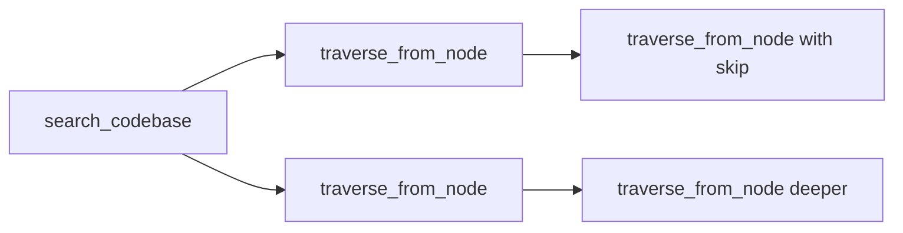

# Code Graph Context MCP Server

[](https://www.npmjs.com/package/code-graph-context)
[](LICENSE)
[](https://typescriptlang.org/)
[](https://neo4j.com/)
[](https://nestjs.com/)
[](https://openai.com/)
[](https://modelcontextprotocol.io/)

A Model Context Protocol (MCP) server that builds rich code graphs to provide deep contextual understanding of TypeScript codebases to Large Language Models. This server parses your codebase using AST analysis, constructs a comprehensive graph representation in Neo4j, and provides intelligent querying capabilities through semantic search and graph traversal.

**Config-Driven & Extensible**: Define custom framework schemas to capture domain-specific patterns beyond the included NestJS support. The parser is fully configurable to recognize your architectural patterns, decorators, and relationships.

## Features

- **Multi-Project Support**: Parse and query multiple projects in a single database with complete isolation via `projectId`
- **Rich Code Graph Generation**: Parses TypeScript projects and creates detailed graph representations with AST-level precision
- **Semantic Search**: Vector-based semantic search using OpenAI embeddings to find relevant code patterns and implementations
- **Natural Language Querying**: Convert natural language questions into Cypher queries using OpenAI assistants API
- **Framework-Aware & Customizable**: Built-in NestJS schema with ability to define custom framework patterns via configuration
- **Weighted Graph Traversal**: Intelligent traversal that scores paths based on relationship importance, query relevance, and depth
- **Workspace & Monorepo Support**: Auto-detects Nx, Turborepo, pnpm, Yarn, and npm workspaces
- **Parallel Parsing**: Multi-threaded parsing with configurable worker pool for maximum CPU utilization
- **Async Parsing**: Background parsing with Worker threads for large codebases without blocking the MCP server
- **Streaming Import**: Chunked processing for projects with 100+ files to prevent memory issues
- **TypeAlias Support**: Full parsing of TypeScript type aliases into graph nodes
- **Incremental Parsing**: Only reparse changed files for faster updates
- **File Watching**: Real-time monitoring with automatic incremental graph updates on file changes
- **Impact Analysis**: Assess refactoring risk with dependency analysis (LOW/MEDIUM/HIGH/CRITICAL scoring)
- **Dead Code Detection**: Find unreferenced exports, uncalled private methods, unused interfaces with confidence scoring
- **Duplicate Code Detection**: Identify structural duplicates (identical AST) and semantic duplicates (similar logic via embeddings)
- **Swarm Coordination**: Multi-agent stigmergic coordination through pheromone markers with exponential decay
- **High Performance**: Optimized Neo4j storage with vector indexing for fast retrieval
- **MCP Integration**: Seamless integration with Claude Code and other MCP-compatible tools

## Architecture

The MCP server consists of several key components:

### Core Components

1. **TypeScript Parser** (`src/core/parsers/typescript-parser-v2.ts`): Uses `ts-morph` to parse TypeScript AST and extract code entities
2. **Graph Storage** (`src/storage/neo4j/neo4j.service.ts`): Neo4j integration for storing and querying the code graph
3. **Embeddings Service** (`src/core/embeddings/embeddings.service.ts`): OpenAI integration for semantic search capabilities
4. **MCP Server** (`src/mcp/mcp.server.ts`): Main MCP server providing tools for code analysis

### Graph Schema

The system uses a dual-schema approach:

- **Core Schema**: AST-level nodes (Classes, Methods, Properties, Imports, etc.)
- **Framework Schema**: Semantic interpretations (NestJS Controllers, Services, HTTP Endpoints, etc.)

## Getting Started

### Prerequisites

- **Node.js** >= 18
- **Neo4j** >= 5.23 with APOC plugin
- **OpenAI API Key** (for embeddings and natural language processing)
- **Docker** (recommended for Neo4j setup)

### Installation

Choose the installation method that works best for you:

#### Option 1: Development Install (From Source)

Best for: Contributing to the project or customizing the code

1. **Clone the repository:**
```bash
git clone https://github.com/drewdrewH/code-graph-context.git
cd code-graph-context
```

2. **Install dependencies:**
```bash
npm install
```

3. **Set up Neo4j using Docker:**
```bash
docker-compose up -d
```

This will start Neo4j with:
- Web interface: http://localhost:7474
- Bolt connection: bolt://localhost:7687
- Username: `neo4j`, Password: `PASSWORD`

4. **Configure environment variables:**
```bash
cp .env.example .env
# Edit .env with your configuration
```

5. **Build the project:**
```bash
npm run build
```

6. **Add to Claude Code:**
```bash
claude mcp add code-graph-context node /absolute/path/to/code-graph-context/dist/mcp/mcp.server.js
```

#### Option 2: NPM Install (Global Package)

Best for: Easy setup and automatic updates

1. **Install the package globally:**
```bash
npm install -g code-graph-context
```

2. **Set up Neo4j** (choose one):

**Option A: Docker (Recommended)**
```bash
docker run -d \
  --name code-graph-neo4j \
  -p 7474:7474 -p 7687:7687 \
  -e NEO4J_AUTH=neo4j/PASSWORD \
  -e NEO4J_PLUGINS='["apoc"]' \
  neo4j:5.23
```

**Option B: Neo4j Desktop**
- Download from [neo4j.com/download](https://neo4j.com/download/)
- Install APOC plugin
- Start database

**Option C: Neo4j Aura (Cloud)**
- Create free account at [neo4j.com/cloud/aura](https://neo4j.com/cloud/platform/aura-graph-database/)
- Note your connection URI and credentials

3. **Add to Claude Code:**
```bash
claude mcp add code-graph-context code-graph-context
```

Then configure in your MCP config file (`~/.config/claude/config.json`):
```json
{
  "mcpServers": {
    "code-graph-context": {
      "command": "code-graph-context",
      "env": {
        "OPENAI_API_KEY": "sk-your-key-here",
        "NEO4J_URI": "bolt://localhost:7687",
        "NEO4J_USER": "neo4j",
        "NEO4J_PASSWORD": "PASSWORD"
      }
    }
  }
}
```

**Note:** The env vars can be configured for any Neo4j instance - local, Docker, cloud (Aura), or enterprise.

### Verify Installation

After installation, verify everything is working:

1. **Check Neo4j is running:**
```bash
# Open Neo4j Browser
open http://localhost:7474
# Login: neo4j / PASSWORD
```

2. **Test APOC plugin:**
```cypher
CALL apoc.help("apoc")
```
Should return a list of APOC functions.

3. **Test MCP server connection:**
```bash
claude mcp list
```
Should show: `code-graph-context: ✓ Connected`

### Troubleshooting

**"APOC plugin not found"**
```bash
# Check Neo4j logs
docker logs code-graph-neo4j

# Verify APOC loaded
docker exec code-graph-neo4j cypher-shell -u neo4j -p PASSWORD "CALL apoc.help('apoc')"

# Restart if needed
docker restart code-graph-neo4j
```

**"OPENAI_API_KEY environment variable is required"**
- Get your API key from: https://platform.openai.com/api-keys
- Add to Claude Code MCP config `env` section
- Verify with: `echo $OPENAI_API_KEY` (if using shell env)

**"Connection refused bolt://localhost:7687"**
```bash
# Check Neo4j is running
docker ps | grep neo4j

# Check ports are not in use
lsof -i :7687

# Start Neo4j if stopped
docker start code-graph-neo4j

# Check Neo4j logs
docker logs code-graph-neo4j
```

**"Neo4j memory errors"**
```bash
# Increase memory in docker-compose.yml or docker run:
-e NEO4J_server_memory_heap_max__size=8G
-e NEO4J_dbms_memory_transaction_total_max=8G

docker restart code-graph-neo4j
```

**"MCP server not responding"**
```bash
# Check Claude Code logs
cat ~/Library/Logs/Claude/mcp*.log

# Test server directly
node /path/to/code-graph-context/dist/mcp/mcp.server.js

# Rebuild if needed
npm run build
```

## Tool Usage Guide

### Available Tools

| Tool | Description | Best For |
|------|-------------|----------|
| `list_projects` | List all parsed projects in database | **Discovery** - see available projects and their status |
| `search_codebase` | Semantic search using vector embeddings | **Starting point** - find code by describing what you need |
| `traverse_from_node` | Explore relationships from a specific node | **Deep dive** - understand dependencies and connections |
| `impact_analysis` | Analyze what depends on a node | **Pre-refactoring** - assess blast radius (LOW/MEDIUM/HIGH/CRITICAL) |
| `parse_typescript_project` | Parse project and build the graph | **Initial setup** - supports async mode for large projects |
| `check_parse_status` | Monitor async parsing job progress | **Monitoring** - track background parsing jobs |
| `start_watch_project` | Start file watching for a project | **Live updates** - auto-update graph on file changes |
| `stop_watch_project` | Stop file watching for a project | **Resource management** - stop monitoring |
| `list_watchers` | List all active file watchers | **Monitoring** - see what's being watched |
| `natural_language_to_cypher` | Convert natural language to Cypher | **Advanced queries** - complex graph queries |
| `detect_dead_code` | Find unreferenced exports, uncalled methods, unused interfaces | **Code cleanup** - identify potentially removable code |
| `detect_duplicate_code` | Find structural and semantic code duplicates | **Refactoring** - identify DRY violations |
| `swarm_pheromone` | Leave pheromone markers on code nodes | **Multi-agent** - stigmergic coordination |
| `swarm_sense` | Query pheromones in the code graph | **Multi-agent** - sense what other agents are doing |
| `swarm_cleanup` | Bulk delete pheromones | **Multi-agent** - cleanup after swarm completion |
| `test_neo4j_connection` | Verify database connectivity | **Health check** - troubleshooting |

> **Note**: All query tools (`search_codebase`, `traverse_from_node`, `impact_analysis`, `natural_language_to_cypher`) require a `projectId` parameter. Use `list_projects` to discover available projects.

### Tool Selection Guide

- **`list_projects`**: First step - discover what projects are available
- **`search_codebase`**: Find code by describing what you're looking for
- **`traverse_from_node`**: Use node IDs from search results to explore relationships
- **`impact_analysis`**: Before refactoring - understand what depends on the code you're changing

### Multi-Project Workflow

All query tools require a `projectId` parameter to ensure project isolation. You can provide:

1. **Project ID**: `proj_a1b2c3d4e5f6` (auto-generated from path)
2. **Project Name**: `my-backend` (extracted from package.json or directory name)
3. **Project Path**: `/path/to/my-backend` (resolved to project ID)

**Typical Workflow:**

```typescript
// Step 1: Discover available projects
list_projects()
// Returns: project names, IDs, status, node/edge counts

// Step 2: Parse a new project (if not already parsed)
parse_typescript_project({
  projectPath: '/path/to/project',
  tsconfigPath: '/path/to/project/tsconfig.json'
})
// Returns: projectId for use in queries

// Step 3: Query the project using any of these ID formats
search_codebase({ projectId: "my-backend", query: "authentication" })
search_codebase({ projectId: "proj_a1b2c3d4e5f6", query: "authentication" })
search_codebase({ projectId: "/path/to/my-backend", query: "authentication" })
```

**Pro Tips:**
- Use project names instead of full IDs for convenience
- Run `list_projects` first to see what's available
- Each project is completely isolated - queries never cross project boundaries

### Sequential Workflow Patterns

The MCP tools are designed to work together in powerful workflows. Here are the most effective patterns:

#### Pattern 1: Discovery → Focus → Deep Dive


#### Pattern 2: Broad Search → Targeted Analysis
1. **Start Broad**: Use `search_codebase` to find relevant starting points
2. **Focus**: Use `traverse_from_node` to explore specific relationships
3. **Paginate**: Use `skip` parameter to explore different sections of the graph

### Tool Deep Dive

#### 1. `search_codebase` - Your Starting Point
**Purpose**: Semantic search using vector embeddings to find the most relevant code nodes.

**Response Structure**: Returns normalized JSON using JSON:API pattern to eliminate duplication:
- **nodes**: Map of unique nodes (stored once, referenced by ID)
- **depths**: Array of depth levels with relationship chains
- **Source Code**: Included by default (truncated to 1000 chars: first 500 + last 500)
- **Statistics**: Total connections, unique files, max depth

**Real Response Example**:
```json
// Query: "JWT token validation"
// Returns:
{
  "totalConnections": 22,
  "uniqueFiles": 2,
  "maxDepth": 3,
  "startNodeId": "MethodDeclaration:697d2c96-1f91-4894-985d-1eece117b72b",
  "nodes": {
    "MethodDeclaration:697d2c96-1f91-4894-985d-1eece117b72b": {
      "id": "MethodDeclaration:697d2c96-1f91-4894-985d-1eece117b72b",
      "type": "MethodDeclaration",
      "filePath": "/packages/jwt-validation/src/lib/jwt.strategy.ts",
      "name": "validate",
      "sourceCode": "validate(payload: EmJwtPayload): EmJwtPayload {\n  ...\n\n... [truncated] ...\n\n  return payload;\n}",
      "hasMore": true,
      "truncated": 1250
    },
    "ClassDeclaration:abc-123": {
      "id": "ClassDeclaration:abc-123",
      "type": "Service",
      "filePath": "/packages/jwt-validation/src/lib/jwt.strategy.ts",
      "name": "JwtStrategy"
    }
  },
  "depths": [
    {
      "depth": 1,
      "count": 8,
      "chains": [
        {
          "via": "HAS_MEMBER",
          "direction": "INCOMING",
          "count": 1,
          "nodeIds": ["ClassDeclaration:abc-123"]
        },
        {
          "via": "HAS_PARAMETER",
          "direction": "OUTGOING",
          "count": 2,
          "nodeIds": ["Parameter:xyz-456", "Parameter:def-789"]
        }
      ]
    },
    {
      "depth": 2,
      "count": 14,
      "chains": [
        {
          "via": "HAS_MEMBER → INJECTS",
          "direction": "INCOMING",
          "count": 3,
          "nodeIds": ["Service:auth-service", "Service:user-service", "Repository:user-repo"],
          "hasMore": 2
        }
      ]
    }
  ]
}
```

**Key Features**:
- **JSON:API Normalization**: Nodes stored once in `nodes` map, referenced by ID to eliminate duplication
- **Source Code Truncation**: Max 1000 chars per snippet (first 500 + last 500 chars)
- **Relationship Chains**: Shows full path like "HAS_MEMBER → INJECTS → USES_REPOSITORY"
- **Direction Indicators**: OUTGOING (what this calls), INCOMING (who calls this)

**Pro Tips**:
- Use specific domain terms: "JWT token validation" vs "authentication"
- Start with limit=1-3 for initial exploration to avoid token limits
- Look for node IDs in `nodes` map to use with `traverse_from_node`
- Check `truncated` field to see how many bytes were hidden from source code

#### 2. `traverse_from_node` - Deep Relationship Exploration
**Purpose**: Explore all connections from a specific node with precise control over depth and pagination.

**Response Structure**: Identical JSON:API format to search_codebase:
- **Focused Traversal**: Starts from your specified node
- **Depth Control**: Configurable max depth (1-10, default 3)
- **Pagination**: Skip parameter for exploring large graphs in chunks
- **Source Code Included by Default**: Set `includeCode: false` for structure-only view

**Real Response Example**:
```json
// Starting from a Service class
// maxDepth: 2, skip: 0, includeCode: true
{
  "totalConnections": 15,
  "uniqueFiles": 4,
  "maxDepth": 2,
  "startNodeId": "ClassDeclaration:credit-check-service",
  "nodes": {
    "ClassDeclaration:credit-check-service": {
      "id": "ClassDeclaration:credit-check-service",
      "type": "Service",
      "filePath": "/src/modules/credit/credit-check.service.ts",
      "name": "CreditCheckService",
      "sourceCode": "@Injectable([CreditCheckRepository, OscilarClient])\nexport class CreditCheckService {\n  ...\n\n... [truncated] ...\n\n}",
      "truncated": 3200
    },
    "Repository:credit-check-repo": {
      "id": "Repository:credit-check-repo",
      "type": "Repository",
      "filePath": "/src/modules/credit/credit-check.repository.ts",
      "name": "CreditCheckRepository"
    }
  },
  "depths": [
    {
      "depth": 1,
      "count": 5,
      "chains": [
        {
          "via": "INJECTS",
          "direction": "OUTGOING",
          "count": 2,
          "nodeIds": ["Repository:credit-check-repo", "VendorClient:oscilar"]
        },
        {
          "via": "HAS_MEMBER",
          "direction": "OUTGOING",
          "count": 3,
          "nodeIds": ["Method:processCheck", "Method:getResult", "Method:rerun"]
        }
      ]
    },
    {
      "depth": 2,
      "count": 10,
      "chains": [
        {
          "via": "INJECTS → USES_DAL",
          "direction": "OUTGOING",
          "count": 1,
          "nodeIds": ["DAL:application-dal"]
        }
      ]
    }
  ]
}
```

**Parameters**:
- `nodeId` (required): Node ID from search_codebase results
- `maxDepth` (default: 3): Traversal depth (1-10)
- `skip` (default: 0): Pagination offset
- `includeCode` (default: **true**): Include source code snippets
- `summaryOnly` (default: false): Just file paths and statistics
- `direction` (default: BOTH): Filter by OUTGOING/INCOMING/BOTH
- `relationshipTypes` (optional): Filter by specific relationships like ["INJECTS", "USES_REPOSITORY"]

**Pagination Strategy**:
```typescript
// Note: Pagination removed in recent commits - all results returned
// Use depth and relationship filtering instead
traverse_from_node({
  nodeId,
  maxDepth: 2,
  relationshipTypes: ["INJECTS"]  // Focus on dependency injection only
})
```

#### 3. `parse_typescript_project` - Graph Generation
**Purpose**: Parse a TypeScript/NestJS project and build the graph database.

**Parameters:**
| Parameter | Type | Default | Description |
|-----------|------|---------|-------------|
| `projectPath` | string | required | Path to project root directory |
| `tsconfigPath` | string | required | Path to tsconfig.json |
| `projectId` | string | auto | Override auto-generated project ID |
| `clearExisting` | boolean | true | Clear existing data (false = incremental) |
| `async` | boolean | false | Run in background Worker thread |
| `useStreaming` | enum | "auto" | "auto", "always", or "never" |
| `chunkSize` | number | 50 | Files per chunk for streaming |
| `projectType` | enum | "auto" | "auto", "nestjs", "vanilla" |
| `watch` | boolean | false | Start file watching after parse (requires `async: false`) |
| `watchDebounceMs` | number | 1000 | Debounce delay for watch mode in ms |

```typescript
// Standard parsing (blocking)
await mcp.call('parse_typescript_project', {
  projectPath: '/path/to/project',
  tsconfigPath: '/path/to/project/tsconfig.json'
});
// Returns: projectId for use in queries

// Async parsing for large projects (non-blocking)
await mcp.call('parse_typescript_project', {
  projectPath: '/path/to/large-project',
  tsconfigPath: '/path/to/large-project/tsconfig.json',
  async: true  // Returns immediately with job ID
});
// Returns: "Job ID: job_abc123... Use check_parse_status to monitor."

// Check async job progress
await mcp.call('check_parse_status', { jobId: 'job_abc123' });
// Returns: progress %, phase, nodes/edges imported

// Incremental parsing (only changed files)
await mcp.call('parse_typescript_project', {
  projectPath: '/path/to/project',
  tsconfigPath: '/path/to/project/tsconfig.json',
  clearExisting: false  // Keep existing, only reparse changed files
});

// Parse and start file watching
await mcp.call('parse_typescript_project', {
  projectPath: '/path/to/project',
  tsconfigPath: '/path/to/project/tsconfig.json',
  watch: true,           // Start watching after parse completes
  watchDebounceMs: 1000  // Wait 1s after last change before updating
});
// File changes now automatically trigger incremental graph updates
```

**Modes:**
- **Standard**: Blocks until complete, best for small-medium projects
- **Async**: Returns immediately, use `check_parse_status` to monitor
- **Streaming**: Auto-enabled for projects >100 files, prevents OOM
- **Incremental**: Set `clearExisting: false` to only reparse changed files
- **Watch**: Set `watch: true` to automatically update graph on file changes (requires sync mode)

**Performance Notes**:
- Large projects (>1000 files) should use `async: true`
- Streaming is auto-enabled for projects >100 files
- Incremental mode detects changes via mtime, size, and content hash
- Worker threads have 30-minute timeout and 8GB heap limit

#### 4. `test_neo4j_connection` - Health Check
**Purpose**: Verify database connectivity and APOC plugin availability.

```typescript
// Simple health check
await mcp.call('test_neo4j_connection');

// Response indicates database status
"Neo4j connected: Connected! at 2025-07-25T19:48:42.676Z
APOC plugin available with 438 functions"
```

#### 5. `detect_dead_code` - Code Cleanup Analysis
**Purpose**: Identify potentially dead code including unreferenced exports, uncalled private methods, and unused interfaces.

**Parameters:**
| Parameter | Type | Default | Description |
|-----------|------|---------|-------------|
| `projectId` | string | required | Project ID, name, or path |
| `excludePatterns` | string[] | [] | Additional file patterns to exclude (e.g., `["*.config.ts"]`) |
| `excludeSemanticTypes` | string[] | [] | Additional semantic types to exclude (e.g., `["EntityClass"]`) |
| `minConfidence` | enum | "LOW" | Minimum confidence: "LOW", "MEDIUM", "HIGH" |
| `summaryOnly` | boolean | false | Return only statistics, not full list |
| `limit` | number | 100 | Maximum items to return |
| `offset` | number | 0 | Pagination offset |

**Response Structure:**
```json
{
  "summary": "Found 15 potentially dead code items",
  "riskLevel": "MEDIUM",
  "statistics": {
    "total": 15,
    "byConfidence": { "HIGH": 5, "MEDIUM": 7, "LOW": 3 },
    "byCategory": { "internal-unused": 10, "library-export": 3, "ui-component": 2 },
    "byType": { "FunctionDeclaration": 8, "InterfaceDeclaration": 4, "MethodDeclaration": 3 }
  },
  "deadCode": [
    {
      "nodeId": "proj_xxx:FunctionDeclaration:abc123",
      "name": "unusedHelper",
      "type": "FunctionDeclaration",
      "filePath": "/src/utils/helpers.ts",
      "lineNumber": 42,
      "confidence": "HIGH",
      "confidenceReason": "Exported but never imported anywhere",
      "category": "internal-unused",
      "reason": "Exported but never imported or referenced"
    }
  ]
}
```

**Framework-Aware Exclusions:**
- Automatically excludes NestJS entry points (controllers, modules, guards, etc.)
- Excludes common entry point files (`main.ts`, `*.module.ts`, `*.controller.ts`)
- Excludes Next.js/React patterns (`page.tsx`, `layout.tsx`, `route.tsx`)

```typescript
// Basic usage
await mcp.call('detect_dead_code', {
  projectId: 'my-backend'
});

// High confidence only with custom exclusions
await mcp.call('detect_dead_code', {
  projectId: 'my-backend',
  minConfidence: 'HIGH',
  excludePatterns: ['*.seed.ts', '*.fixture.ts'],
  excludeSemanticTypes: ['EntityClass', 'DTOClass']
});
```

#### 6. `detect_duplicate_code` - DRY Violation Detection
**Purpose**: Identify duplicate code using structural (identical AST) and semantic (similar embeddings) analysis.

**Parameters:**
| Parameter | Type | Default | Description |
|-----------|------|---------|-------------|
| `projectId` | string | required | Project ID, name, or path |
| `type` | enum | "all" | Detection type: "structural", "semantic", "all" |
| `scope` | enum | "all" | Scope: "methods", "functions", "classes", "all" |
| `minSimilarity` | number | 0.8 | Minimum similarity threshold (0.5-1.0) |
| `maxResults` | number | 50 | Maximum duplicate groups to return |
| `includeCode` | boolean | true | Include source code snippets |
| `summaryOnly` | boolean | false | Return only statistics |

**Response Structure:**
```json
{
  "summary": "Found 8 duplicate code groups across 12 files",
  "statistics": {
    "totalGroups": 8,
    "totalDuplicates": 24,
    "byType": {
      "structural": { "groups": 3, "items": 9 },
      "semantic": { "groups": 5, "items": 15 }
    },
    "byConfidence": { "HIGH": 4, "MEDIUM": 3, "LOW": 1 }
  },
  "duplicates": [
    {
      "groupId": "dup_1",
      "type": "structural",
      "similarity": 1.0,
      "confidence": "HIGH",
      "category": "cross-file",
      "recommendation": "Extract to shared utility",
      "items": [
        {
          "nodeId": "proj_xxx:MethodDeclaration:abc",
          "name": "formatDate",
          "filePath": "/src/utils/date.ts",
          "lineNumber": 15,
          "sourceCode": "formatDate(date: Date): string { ... }"
        },
        {
          "nodeId": "proj_xxx:MethodDeclaration:def",
          "name": "formatDate",
          "filePath": "/src/helpers/formatting.ts",
          "lineNumber": 42,
          "sourceCode": "formatDate(date: Date): string { ... }"
        }
      ]
    }
  ]
}
```

**Detection Types:**
- **Structural**: Identical normalized code (same AST after removing comments, normalizing names)
- **Semantic**: Similar logic via vector embeddings (requires embeddings enabled during parse)

**Categories:**
- `ui-component`: Duplicates in UI component directories
- `cross-app`: Duplicates across monorepo apps
- `same-file`: Duplicates within the same file
- `cross-file`: Duplicates across different files

```typescript
// Find all duplicates
await mcp.call('detect_duplicate_code', {
  projectId: 'my-backend'
});

// Only structural duplicates in methods
await mcp.call('detect_duplicate_code', {
  projectId: 'my-backend',
  type: 'structural',
  scope: 'methods'
});

// High similarity semantic duplicates
await mcp.call('detect_duplicate_code', {
  projectId: 'my-backend',
  type: 'semantic',
  minSimilarity: 0.9
});
```

#### 7. File Watching Tools
**Purpose**: Monitor file changes and automatically update the graph.

```typescript
// Option 1: Start watching during parse
await mcp.call('parse_typescript_project', {
  projectPath: '/path/to/project',
  tsconfigPath: '/path/to/project/tsconfig.json',
  watch: true  // Starts watching after parse completes
});

// Option 2: Start watching a previously parsed project
await mcp.call('start_watch_project', {
  projectId: 'my-backend',      // Project name, ID, or path
  debounceMs: 2000              // Optional: wait 2s after last change (default: 1000)
});

// List all active watchers
await mcp.call('list_watchers');
// Returns: watcher status, pending changes, last update time

// Stop watching a project
await mcp.call('stop_watch_project', {
  projectId: 'my-backend'
});
```

**How It Works:**
1. File watcher monitors `.ts` and `.tsx` files using native OS events
2. Changes are debounced to batch rapid edits
3. Only modified files are re-parsed (incremental)
4. Cross-file edges are preserved during updates
5. Graph updates happen automatically in the background

**Resource Limits:**
- Maximum 10 concurrent watchers
- 1000 pending events per watcher
- Graceful cleanup on server shutdown

#### 8. Swarm Coordination Tools
**Purpose**: Enable multiple parallel agents to coordinate work through stigmergic pheromone markers in the code graph—no direct messaging needed.

**Core Concepts:**
- **Pheromones**: Markers attached to graph nodes that decay over time
- **swarmId**: Groups related agents for bulk cleanup when done
- **Workflow States**: `exploring`, `claiming`, `modifying`, `completed`, `blocked` (mutually exclusive per agent+node)
- **Flags**: `warning`, `proposal`, `needs_review` (can coexist with workflow states)

**Pheromone Types & Decay:**
| Type | Half-Life | Use |
|------|-----------|-----|
| `exploring` | 2 min | Browsing/reading |
| `modifying` | 10 min | Active work |
| `claiming` | 1 hour | Ownership |
| `completed` | 24 hours | Done |
| `warning` | Never | Danger |
| `blocked` | 5 min | Stuck |
| `proposal` | 1 hour | Awaiting approval |
| `needs_review` | 30 min | Review requested |

```typescript
// Orchestrator: Generate swarm ID and spawn agents
const swarmId = `swarm_${Date.now()}`;

// Agent: Check what's claimed before working
await mcp.call('swarm_sense', {
  projectId: 'my-backend',
  swarmId,
  types: ['claiming', 'modifying']
});

// Agent: Claim a node before working
await mcp.call('swarm_pheromone', {
  projectId: 'my-backend',
  nodeId: 'proj_xxx:ClassDeclaration:abc123',  // From search_codebase or traverse_from_node
  type: 'claiming',
  agentId: 'agent_1',
  swarmId
});

// Agent: Mark complete when done
await mcp.call('swarm_pheromone', {
  projectId: 'my-backend',
  nodeId: 'proj_xxx:ClassDeclaration:abc123',
  type: 'completed',
  agentId: 'agent_1',
  swarmId,
  data: { summary: 'Added soft delete support' }
});

// Orchestrator: Clean up when swarm is done
await mcp.call('swarm_cleanup', {
  projectId: 'my-backend',
  swarmId,
  keepTypes: ['warning']  // Preserve warnings
});
```

**Important**: Node IDs must come from graph tool responses (`search_codebase`, `traverse_from_node`). Never fabricate node IDs—they are hash-based strings like `proj_xxx:ClassDeclaration:abc123`.

### Workflow Examples

#### Example 1: Understanding Authentication Flow
```typescript
// Step 1: Find authentication-related code
const searchResult = await mcp.call('search_codebase', {
  projectId: 'my-backend',  // Required: project name, ID, or path
  query: 'JWT token validation authentication'
});

// Step 2: Extract node ID from most relevant result
const nodeId = "proj_abc123:MethodDeclaration:697d2c96";

// Step 3: Explore immediate relationships
const immediateConnections = await mcp.call('traverse_from_node', {
  projectId: 'my-backend',
  nodeId,
  maxDepth: 2
});

// Step 4: Go deeper to understand full authentication chain
const deepConnections = await mcp.call('traverse_from_node', {
  projectId: 'my-backend',
  nodeId,
  maxDepth: 4
});

// Step 5: Assess refactoring impact
const impact = await mcp.call('impact_analysis', {
  projectId: 'my-backend',
  nodeId
});
// Returns: risk level (LOW/MEDIUM/HIGH/CRITICAL), dependents, affected files
```

#### Example 2: API Endpoint Analysis
```typescript
// Step 1: Search for controller endpoints
const controllerSearch = await mcp.call('search_codebase', {
  projectId: 'my-backend',
  query: 'HTTP controller endpoints routes POST GET'
});

// Step 2: Find a controller node ID from results
const controllerNodeId = "proj_abc123:ClassDeclaration:controller-uuid";

// Step 3: Explore what endpoints this controller exposes
const endpoints = await mcp.call('traverse_from_node', {
  projectId: 'my-backend',
  nodeId: controllerNodeId,
  maxDepth: 2
});

// Step 4: For each endpoint found, explore its dependencies
const endpointNodeId = "proj_abc123:MethodDeclaration:endpoint-uuid";
const endpointDeps = await mcp.call('traverse_from_node', {
  projectId: 'my-backend',
  nodeId: endpointNodeId,
  maxDepth: 3
});
```

#### Example 3: Service Dependency Mapping
```typescript
// Step 1: Find a specific service
const serviceSearch = await mcp.call('search_codebase', {
  projectId: 'my-backend',
  query: 'UserService injectable dependency injection'
});

// Step 2: Map all its dependencies (what it injects)
const serviceDeps = await mcp.call('traverse_from_node', {
  projectId: 'my-backend',
  nodeId: "proj_abc123:ClassDeclaration:user-service-uuid",
  maxDepth: 2,
  direction: "OUTGOING"  // What this service depends on
});

// Step 3: Impact analysis - what depends on this service
const impact = await mcp.call('impact_analysis', {
  projectId: 'my-backend',
  nodeId: "proj_abc123:ClassDeclaration:user-service-uuid"
});
// Returns: risk level, all dependents, affected files
```

### Advanced Usage Tips

#### Understanding Response Format (JSON:API Normalization)

**Key Insight**: All responses use JSON:API pattern to eliminate duplication by storing each node once and referencing by ID.

**How to Read Responses**:
1. **Start with `nodes` map**: All unique nodes are stored here once
2. **Look at `depths` array**: Shows how nodes are connected at each depth level
3. **Follow `nodeIds` references**: Use IDs to look up full node data in `nodes` map
4. **Check `truncated` field**: Indicates how many bytes of source code were hidden

**Example Reading Pattern**:
```typescript
const response = await search_codebase({
  projectId: "my-backend",
  query: "authentication"
});

// 1. Get overview statistics
console.log(`Found ${response.totalConnections} connections across ${response.uniqueFiles} files`);

// 2. Examine the starting node
const startNode = response.nodes[response.startNodeId];
console.log(`Starting from: ${startNode.name} in ${startNode.filePath}`);

// 3. Explore first depth level
const firstDepth = response.depths[0];
firstDepth.chains.forEach(chain => {
  console.log(`Via ${chain.via}: ${chain.count} connections (${chain.direction})`);

  // 4. Look up actual node details
  chain.nodeIds.forEach(nodeId => {
    const node = response.nodes[nodeId];
    console.log(`  - ${node.name} (${node.type})`);
  });
});
```

#### Managing Large Responses
- **Relationship Filtering**: Use `relationshipTypes` to focus on specific connections
- **Structure-Only View**: Set `includeCode: false` to exclude source code snippets
- **Summary Mode**: Use `summaryOnly: true` for just file paths and statistics

#### Efficient Graph Exploration
- **Breadth First**: Start with low `maxDepth` (1-2) to get overview
- **Depth Second**: Increase `maxDepth` (3-5) for detailed analysis
- **Direction Filtering**: Use `direction: "OUTGOING"` or `"INCOMING"` to focus exploration
- **Source Code on Demand**: Source code included by default but truncated to 1000 chars

#### Weighted Traversal

The `search_codebase` tool uses **weighted traversal** by default (`useWeightedTraversal: true`) to intelligently prioritize which relationships to explore. This produces more relevant results by scoring each node at every depth level.

**How Scoring Works**:

Each potential path is scored using three factors multiplied together:

1. **Edge Weight** (0.0-1.0): How important is this relationship type?
   - Critical (0.9-0.95): `INJECTS`, `EXPOSES`, `ROUTES_TO` - core architectural relationships
   - High (0.8-0.88): `EXTENDS`, `IMPLEMENTS`, `USES_REPOSITORY` - important semantic links
   - Medium (0.5-0.6): `IMPORTS`, `EXPORTS`, `HAS_MEMBER` - structural relationships
   - Low (0.3-0.4): `DECORATED_WITH`, `HAS_PARAMETER` - metadata relationships

2. **Node Similarity**: Cosine similarity between the node's embedding and your query embedding. Nodes semantically related to your search rank higher.

3. **Depth Penalty**: Exponential decay (default 0.85 per level). Closer nodes are preferred:
   - Depth 1: 1.0 (no penalty)
   - Depth 2: 0.85
   - Depth 3: 0.72

**When to Disable**:
```typescript
// Use standard traversal for exhaustive exploration
search_codebase({
  projectId: "my-backend",
  query: "...",
  useWeightedTraversal: false
})
```

#### Performance Optimization
- **Token Efficiency**: JSON:API normalization eliminates duplicate nodes in responses
- **Code Truncation**: Source code limited to 1000 chars (first 500 + last 500) to prevent token overflow
- **Memory**: Large traversals may hit Neo4j memory limits (increase heap size if needed)
- **Caching**: Node IDs are persistent; save interesting ones for later exploration

## Claude Code Integration Tips

### Guiding Tool Usage with claude.md

You can add a `claude.md` file to your repository root to help Claude Code understand when to use these MCP tools effectively. Here are some useful patterns:

#### Trigger Word Hints

```markdown
## Code Search Tools

**Use `search_codebase` for:**
- "Where is...", "Find...", "Show me [specific thing]"
- Example: "Where is the authentication middleware?"

**Use `natural_language_to_cypher` for:**
- "List all...", "How many...", "Count..."
- Example: "List all API controllers"

**Use `traverse_from_node` for:**
- Deep dependency analysis after initial search
- "What depends on X?", "Trace the flow..."
```

#### Weighted Traversal Hints

```markdown
**Use `useWeightedTraversal: true` for:**
- Service/Controller classes with many dependencies
- Queries with depth > 3
- Cleaner, more relevant results

**Recommended settings:**
- Default: `maxDepth: 5, snippetLength: 900`
- Simple lookups: `maxDepth: 2`
```

#### Framework-Specific Patterns

Document your custom node types and relationships so Claude knows what to search for:

```markdown
**Custom Node Types:**
- `PaymentProcessor` - Payment integrations
- `EmailTemplate` - Email templates

**Custom Relationships:**
- `PROCESSES_PAYMENT` - Service → PaymentProcessor
- `SENDS_EMAIL` - Service → EmailTemplate
```

#### Common Query Examples

```markdown
**Finding authentication:**
search_codebase({ projectId: "my-project", query: "JWT authentication middleware" })

**Tracing dependencies:**
traverse_from_node({ projectId: "my-project", nodeId: "...", direction: "OUTGOING", maxDepth: 5 })

**Impact analysis:**
impact_analysis({ projectId: "my-project", nodeId: "..." })
```

## Framework Support

### NestJS Framework Schema

The server provides deep understanding of NestJS patterns:

#### Node Types
- **Controllers**: HTTP endpoint handlers with route analysis
- **Services**: Business logic providers with dependency injection mapping
- **Modules**: Application structure with import/export relationships
- **Guards**: Authentication and authorization components
- **Pipes**: Request validation and transformation
- **Interceptors**: Request/response processing middleware
- **DTOs**: Data transfer objects with validation decorators
- **Entities**: Database models with relationship mapping

#### Relationship Types
- **Module System**: `MODULE_IMPORTS`, `MODULE_PROVIDES`, `MODULE_EXPORTS`
- **Dependency Injection**: `INJECTS`, `PROVIDED_BY`
- **HTTP API**: `EXPOSES`, `ACCEPTS`, `RESPONDS_WITH`
- **Security**: `GUARDED_BY`, `TRANSFORMED_BY`, `INTERCEPTED_BY`

### Example Graph Structure

```
┌─────────────────┐    EXPOSES     ┌──────────────────┐
│   UserController│──────────────→│  POST /users     │
│   @Controller   │                │  @Post()         │
└─────────────────┘                └──────────────────┘
         │                                   │
      INJECTS                           ACCEPTS
         ↓                                   ↓
┌─────────────────┐                ┌──────────────────┐
│   UserService   │                │   CreateUserDto  │
│   @Injectable   │                │   @IsString()    │
└─────────────────┘                └──────────────────┘
         │
      MANAGES
         ↓
┌─────────────────┐
│   User Entity   │
│   @Entity()     │
└─────────────────┘
```

## Configuration

### Environment Variables

| Variable | Description | Default |
|----------|-------------|---------|
| `OPENAI_API_KEY` | OpenAI API key for embeddings and LLM | Required |
| `OPENAI_ASSISTANT_ID` | Reuse existing OpenAI assistant | Optional |
| `NEO4J_URI` | Neo4j database URI | `bolt://localhost:7687` |
| `NEO4J_USER` | Neo4j username | `neo4j` |
| `NEO4J_PASSWORD` | Neo4j password | `PASSWORD` |
| `NEO4J_QUERY_TIMEOUT_MS` | Neo4j query timeout | `30000` (30s) |
| `NEO4J_CONNECTION_TIMEOUT_MS` | Neo4j connection timeout | `10000` (10s) |
| `OPENAI_EMBEDDING_TIMEOUT_MS` | Embedding API timeout | `60000` (60s) |
| `OPENAI_ASSISTANT_TIMEOUT_MS` | Assistant API timeout | `120000` (120s) |

### Parse Options

Customize parsing behavior:

```typescript
const parseOptions = {
  includePatterns: ['**/*.ts', '**/*.tsx'],
  excludePatterns: [
    'node_modules/',
    'dist/',
    'coverage/',
    '.d.ts',
    '.spec.ts',
    '.test.ts'
  ],
  maxFiles: 1000,
  frameworkSchemas: [NESTJS_FRAMEWORK_SCHEMA]
};
```

## Limitations

### Current Limitations

1. **Language Support**: Currently supports TypeScript/NestJS only
2. **Framework Support**: Primary focus on NestJS patterns (React, Angular, Vue planned)
3. **File Size**: Large files (>10MB) may cause parsing performance issues
4. **Memory Usage**: Mitigated by streaming import for large projects
5. **Vector Search**: Requires OpenAI API for semantic search functionality
6. **Response Size**: Large graph traversals can exceed token limits (25,000 tokens max)
7. **Neo4j Memory**: Database memory limits can cause query failures on large graphs

### Performance Considerations

- **Large Projects**: Use `async: true` for projects with >1000 files
- **Streaming**: Auto-enabled for >100 files to prevent memory issues
- **Graph Traversal**: Deep traversals (>5 levels) may be slow for highly connected graphs
- **Embedding Generation**: Initial parsing with embeddings can take several minutes for large codebases
- **Neo4j Memory**: Recommend at least 4GB RAM allocation for Neo4j with large graphs
- **Worker Timeout**: Async parsing has 30-minute timeout for safety

### Known Issues

1. **Complex Type Inference**: Advanced TypeScript type gymnastics may not be fully captured
2. **Dynamic Imports**: Runtime module loading not tracked in static analysis
3. **Decorator Arguments**: Complex decorator argument patterns may not be fully parsed

## Troubleshooting

### Common Issues

#### Neo4j Connection Failed
```bash
# Check if Neo4j is running
docker ps | grep neo4j

# Check Neo4j logs
docker logs codebase-neo4j

# Verify APOC plugin
curl -u neo4j:PASSWORD http://localhost:7474/db/neo4j/tx/commit \
  -H "Content-Type: application/json" \
  -d '{"statements":[{"statement":"CALL apoc.help(\"apoc\") YIELD name RETURN count(name) as count"}]}'
```

#### Neo4j Memory Issues
If you encounter errors like "allocation of an extra X MiB would use more than the limit":

```bash
# Increase Neo4j memory limits in docker-compose.yml
NEO4J_server_memory_heap_max__size=8G
NEO4J_server_memory_pagecache_size=4G
NEO4J_dbms_memory_transaction_total_max=8G

# Restart Neo4j
docker-compose restart neo4j
```

#### Token Limit Exceeded
If responses exceed token limits:

```typescript
// Reduce depth or use structure-only view
traverse_from_node({ nodeId: "...", maxDepth: 2, includeCode: false })

// Use pagination with skip
traverse_from_node({ nodeId: "...", maxDepth: 2, skip: 0 })
traverse_from_node({ nodeId: "...", maxDepth: 2, skip: 20 })
```

#### OpenAI API Issues
```bash
# Test API key
curl https://api.openai.com/v1/models \
  -H "Authorization: Bearer $OPENAI_API_KEY"

# Check embedding model availability
curl https://api.openai.com/v1/models/text-embedding-3-large \
  -H "Authorization: Bearer $OPENAI_API_KEY"
```

#### Parsing Failures
```bash
# Check TypeScript configuration
npx tsc --noEmit --project /path/to/tsconfig.json

# Verify file permissions
ls -la /path/to/project

# Check memory usage during parsing
node --max-old-space-size=8192 dist/mcp/mcp.server.js
```

### Debug Mode

Enable detailed logging:

```bash
export DEBUG=mcp:*
export NODE_ENV=development
```

## Contributing

1. Fork the repository
2. Create a feature branch: `git checkout -b feature/amazing-feature`
3. Commit your changes: `git commit -m 'Add amazing feature'`
4. Push to the branch: `git push origin feature/amazing-feature`
5. Open a Pull Request

### Development Setup

```bash
# Install dependencies
npm install

# Run in development mode
npm run dev

# Run tests
npm test

# Lint code
npm run lint

# Format code
npm run format
```

## License

This project is proprietary software. All rights reserved - see the [LICENSE](LICENSE) file for details.

## Acknowledgments

- [Model Context Protocol](https://modelcontextprotocol.io/) by Anthropic
- [Neo4j](https://neo4j.com/) for graph database technology
- [ts-morph](https://ts-morph.com/) for TypeScript AST manipulation
- [OpenAI](https://openai.com/) for embeddings and natural language processing
- [NestJS](https://nestjs.com/) for the framework patterns and conventions

## Support

- Create an [Issue](https://github.com/drewdrewH/code-graph-context/issues) for bug reports or feature requests
- Join the [MCP Discord](https://discord.gg/mcp) for community support
- Check the [MCP Documentation](https://modelcontextprotocol.io/docs) for MCP-specific questions

---
